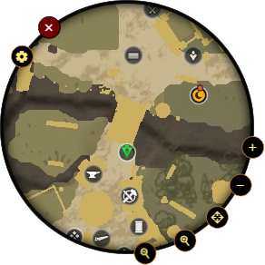

# Aeternum Minimap
<p align="center"></p>

Do you want to use [Aeternum map](https://aeternum-map.gg/) as overlay but at same time want it like a real minimap?

Now you can use [Aeternum map](https://aeternum-map.gg/) as real minimap overlay with simple steps.

## Usage
- Download the latest release from [Releases page](https://github.com/D4rkTT/aeternum-minimap/releases)
- Get location straeming token from Aeternum map overworlf app
- Start Aeternum Minimap it will open [aeternum-map.gg](https://aeternum-map.gg/), setup the live location with step 1 token
- Choose settings, filters...etc as you like (you can change it anytime later)
- Close the window

Now you will get minimap overlay of [Aeternum map](https://aeternum-map.gg/)

## Notes
- If you want to close the whole app just click x button on the minimap
- If you want to open aeternum map window at any time to adjust filters, routes...etc you can click on settings button on the minimap it will open aeternum map window change settings you want then close it then the minimap will show again
- All settings will be saved automatically so will not change after the app close

## Advantages of using this app over other overlay apps
When i made this project, the only thing i wanted is controlling the whole minimap from the overlay not another window.

So now you can edit minimap settings you like directly from the minimap buttons like minimap size, zoom and location.

## For Developers
This application based on [ElectronJS](https://www.electronjs.org) so make sure you have installed it before next steps.

To run the app:
```
npm run test 
```

To build the app:
``` 
npm run dist 
```

## Contribution

This app is Open-Source. if you want to contributors you are welcomed !

## Licensing

MIT
